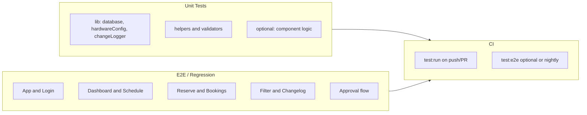

# 開發與測試計劃（Development & Testing Plan）

**目標：** 配合 Dashboard 全需求改動，建立可重複、穩定的開發節奏，並以 **Unit Test、Regression / E2E Test** 確保品質與不影響線上。

**與主計劃關係：** 本文件對應「Dashboard 全需求計劃」的實作與驗證；分批上線與環境分離見主計劃「不影響線上的測試與上線建議」。

---

## 一、現有測試資產

| 類型 | 工具 | 位置 | 覆蓋範圍 |
|------|------|------|----------|
| Unit | Vitest | `vite.config.js` → `test`、`src/test/setup.js` | `src/lib/database.test.js`、`hardwareConfig.test.js`、`constants.test.js` |
| E2E | Playwright | `playwright.config.js`、`e2e/*.spec.js` | `app.spec.js`（未登入）、`dashboard.spec.js`（需 E2E_AUTH_EMAIL/PASSWORD） |
| CI | GitHub Actions | `.github/workflows/test.yml`（若有） | 依現有設定：unit + e2e |

**指令：**
- `npm run test` / `npm run test:run` / `npm run test:unit`：Vitest
- `npm run test:e2e`：Playwright（會起 port 5175）

---

## 二、開發計劃（與分批上線對齊）

每批開發完成後，必須通過對應的 **Unit + Regression/E2E** 再合併或上線。

### 批次 1：純 UI／文案（低風險）

**範圍：** Header 移除搜尋、Fleet 區塊、Decommissioned、卡片狀態與火箭、Calendar 改為 Schedule、Today／週月切換。

**開發要點：**
- 改動集中於 `Header.jsx`、`Dashboard.jsx`、`EditVehicleModal.jsx`、`VehicleCard.jsx`、`CalendarOverviewModal.jsx` 及相關 CSS。
- 不改 API、不改 DB schema。

**交付物：**
- 程式變更 + 對應 E2E 更新（見下「Regression 清單」）。
- 本批完成後跑完整 regression，通過再上線。

---

### 批次 2：查詢與過濾邏輯（低風險）

**範圍：** 取消預約 `deleted_at`、Reserve 月曆週一、月曆箭頭置中、硬體預覽一致性。

**開發要點：**
- `BookingModal.jsx` 查詢加 `.is('deleted_at', null)`；`Dashboard.jsx` next_booking 同様。
- 月曆表頭與 offset 改為週一為第一天；CSS 調整箭頭與月份置中。
- 確認車輛列表與編輯表單的 hw_config 讀寫一致。

**交付物：**
- 程式變更。
- 可補 unit：若 `database.js` 有 `getBookingsByUser` 或類似對外介面，可加「含 deleted_at 過濾」的測試（或 mock 層驗證 query 參數）。

---

### 批次 3：表單與欄位（中風險）

**範圍：** Department 必填、Parameter Change 欄位、Pilot 非必／Who ordered 必填、My Bookings 日期顯示。

**開發要點：**
- EditVehicleModal：Department 下拉（必填）、Parameter Change 文字欄位；payload 與 DB 對齊。
- BookingModal：validateForm 調整；Who ordered 必填邏輯。
- My Bookings：確認 `formatRange(start_time, end_time)` 與 API 回傳欄位，必要時修正顯示或 API select。

**交付物：**
- 程式 + 若有 migration（例如 vehicles 新欄位）需在 staging 驗證。
- Unit：EditVehicleModal 表單驗證（Department 必填、Parameter Change 有值時寫入 payload）可用 React Testing Library + mock；BookingModal 驗證邏輯可抽成純函數再單測。

---

### 批次 4：新功能（Filter、Schedule 篩選、Changelog）（中風險）

**範圍：** 主版 Filter 彈窗、Schedule 內篩選、Changelog 卡片圖示＋彈窗（3 筆＋Show More 捲動）。

**開發要點：**
- Filter：Header 左側按鈕、彈窗元件、Dashboard 依 `selectedVehicleIds` 過濾。
- Schedule：月/週＋車輛篩選狀態、查詢結果前端過濾。
- Changelog：VehicleCard 圖示、ChangeHistoryModal 或包一層（預設 3 筆、Show More 後可捲動）；Profile 移除 Change Log 選單。

**交付物：**
- 程式 + 新元件。
- Unit：Filter 依 department 分組、選中 id 列表的邏輯可抽成純函數單測。
- E2E：新增/更新場景（見下「Regression 清單」）。

---

### 批次 5：Iza 審核與通知（高風險）

**範圍：** `bookings.status`、`approval_requests`、`notifications`、Reserve 分流、通知區、Approve/Reject/Edit。

**開發要點：**
- DB migration（可逆、向後相容）在 staging 先跑。
- BookingModal：Marketing 車輛且非審核者 → 寫入 pending_approval + approval_request + notification。
- 通知區：僅審核者（izabela@deltaquad.com、a.chang@deltaquad.com）可見；Approve/Reject/Edit 行為與主計劃一致。

**交付物：**
- Migration 腳本 + 程式。
- Unit：審核者名單判斷、status 分支邏輯可單測；DB 層用 mock。
- E2E：審核流程單獨 spec，用測試帳號在 staging 跑。

---

## 三、測試策略總覽

- **Unit**：快速、不依賴網路與 DB，鎖定單一模組行為；每次改動相關模組後必跑。
- **E2E / Regression**：模擬真實操作，確保關鍵流程未被改壞；每批完成後跑完整套，上線前再跑一次。
- **CI**：至少跑 `npm run test:run`；E2E 可選每 PR 跑或僅 main / 定時跑 staging。

---

## 四、Unit Test 計劃

### 4.1 既有與維持

- **`src/lib/database.test.js`**：維持現有 mock Supabase 寫法；若有新方法（例如依 `deleted_at` 過濾、getBookingsByUser 欄位）補測試。
- **`src/lib/hardwareConfig.test.js`**：維持；若新增 parameter_change 相關欄位不影響 hardwareConfig 則無需改。
- **`src/lib/constants.test.js`**：維持。

### 4.2 建議新增／擴充

| 檔案／模組 | 測試重點 |
|------------|----------|
| **changeLogger.js** | `getChangeHistory(entityType, entityId, limit)` 回傳形狀；`formatChangedFields`、`getFieldLabel` 純函數（可 mock supabase）。 |
| **database.js** | 若有 `getBookingsByUser` 或過濾 `deleted_at` 的介面，驗證呼叫參數或回傳結構；`deleteBooking` 已有，可補「寫入 deleted_at」的 mock 驗證。 |
| **Filter 邏輯** | 若篩選「依 department 分組 → 車輛 id 列表」抽成 `src/lib/filterVehicles.js` 或類似，單測：輸入 vehicles 陣列，輸出分組與選中 id 過濾結果。 |
| **BookingModal 驗證** | 將 `validateForm` 抽成接受 (formData, selectedDates, whoOrderedMode, whoOrderedCustom) 的純函數，單測：Pilot 可空、Who ordered 在 others 時必填、Project 必填。 |
| **EditVehicleModal 驗證** | 同上，Department 必填、Parameter Change 可選，單測 payload 形狀。 |

### 4.3 撰寫原則

- 依賴 Supabase / Auth 的一律 **mock**，不在 unit 打真實後端。
- 優先測 **純函數** 與 **邊界條件**（空陣列、null、極端日期）。
- 檔名：`*.test.js` 或 `*.spec.js`，與現有一致。

---

## 五、Regression / E2E 計劃（穩定化）

### 5.1 穩定 Regression 的原則

1. **選擇器優先順序**  
   - 優先使用 **role + name**（`getByRole('button', { name: /schedule/i })`）。  
   - 其次 **data-testid**（例如 `data-testid="schedule-trigger"`），僅在關鍵按鈕／表單使用，避免過多。  
   - 避免僅依 class、DOM 層級或文案長句，以降低 UI 小改就壞的機率。

2. **E2E 與環境**  
   - 本機：`npm run test:e2e` 對應 localhost:5175（playwright.config 內 webServer）。  
   - CI：同一 config，CI 起 app；或 E2E 僅在 main / 定時跑，對應 staging URL（需 BASE_URL 與測帳號）。  
   - 認證：沿用 `E2E_AUTH_EMAIL` / `E2E_AUTH_PASSWORD`；Regression 清單中「需登入」的案例一律依此登入再操作。

3. **資料與冪等**  
   - 不依賴「某台車叫 R&D-125 一定存在」；改為「登入後有車輛列表或空狀態」或「某個 data-testid 的區塊存在」。  
   - 若有建立預約／車輛，盡量用可辨識的專案名或後綴，並在 after 或專用 cleanup 清理，避免累積造成衝突。

4. **等待與重試**  
   - 使用 `expect(locator).toBeVisible({ timeout: 5000 })` 等明確等待，避免固定 `page.waitForTimeout`。  
   - Playwright 的 retries（CI 建議 2）保留，並定期檢視 flaky 案例，修正選擇器或流程。

### 5.2 Regression 清單（E2E 場景）

以下場景應在 **每批完成後** 與 **上線前** 全過。E2E 檔可依模組拆成多個 spec，但清單保持一份以便勾選。

| # | 場景 | 預期 | 備註 |
|---|------|------|------|
| R1 | 未登入 → 進入首頁 | 導向 login，Sign In 可見 | 現有 app.spec |
| R2 | 登入頁結構 | 有 Google 登入、UAV Fleet Command 等 | 現有 app.spec |
| R3 | 登入後 Dashboard | Schedule（原 Calendar Overview）按鈕可見、車輛列表或空狀態可見 | 更新為 Schedule；dashboard.spec |
| R4 | 開啟 Schedule 彈窗 | 標題為 Schedule（或 Fleet Schedule） | 新／更新 |
| R5 | 車輛卡片：RESERVE | 點 RESERVE 開預約彈窗，標題含 Reserve / Reserving | 現有 dashboard.spec 可擴充 |
| R6 | 預約彈窗：必填與選填 | Project 必填、Who ordered 必填、Pilot 可空；送出驗證錯誤時有訊息 | 新 |
| R7 | 編輯車輛 | 點編輯開 Edit Vehicle，無 Decommissioned 選項，有 Department 下拉 | 新／更新 |
| R8 | 主版 Filter | 點 Filter 開彈窗，可選部門／車輛，確認後列表只顯示所選 | 新 |
| R9 | Changelog | 卡片上有 changelog 圖示，點擊開彈窗、可見最近紀錄與 Show More | 新 |
| R10 | Iza 審核（staging） | 用 a.chang 登入 → 預約 Marketing 車輛 → 通知區出現 → Approve/Reject/Edit 行為正確 | 新；可單獨 spec，僅在有審核者帳號的環境跑 |

### 5.3 E2E 檔案建議結構

- `e2e/app.spec.js`：未登入、登入頁（維持）。
- `e2e/dashboard.spec.js`：登入後 Dashboard、Schedule、RESERVE 開 modal、Filter、Changelog（擴充）。
- `e2e/booking.spec.js`（可選）：預約表單必填、日期選擇、衝突提示、tooltip。
- `e2e/approval.spec.js`（可選）：僅在設定了審核者帳號時跑；Marketing 預約 → 通知 → Approve/Reject/Edit。

所有「需登入」的案例統一用 `ensureLoggedIn` 或共用 fixture，並將「Schedule」按鈕名稱從 Calendar Overview 改為 Schedule。

---

## 六、CI 與在地執行

### 6.1 本地開發流程

1. 功能開發在分支完成後：  
   `npm run test:run` → 全過再 `npm run test:e2e`（可選，但每批結束前必跑）。
2. 提交前：跑一次完整 Regression 清單（至少 R1–R5；若有 Filter/Changelog 則含 R7–R9）。
3. 若專案有 pre-push hook：可設定執行 `npm run test:run`，避免忘記。

### 6.2 CI 建議

- **每次 push/PR**：執行 `npm run test:run`（Unit）。失敗則不可合併。
- **E2E**：  
  - 選項 A：同 workflow 起 `npx vite --port 5175`，跑 `npm run test:e2e`（不設 E2E_AUTH_* 則跳過需登入案例）。  
  - 選項 B：僅在 merge 到 main 或定時（如 nightly）對 staging URL 跑完整 E2E（含登入與 R10）。
- 若 E2E 不穩定：先以 Unit 必過為主，E2E 僅在 main 或 nightly 跑，並在計劃中註明「Regression 手動勾選 + 自動 E2E 子集」。

---

## 七、每批檢查表（開發 + 測試）

每批完成時可依此勾選，確保不影響線上且 regression 穩定。

**批次 1**
- [ ] 程式改動完成（Header、Fleet、Decommissioned、卡片、Schedule、Today/週月）
- [ ] `npm run test:run` 通過
- [ ] E2E：R1–R5 更新（Schedule 按鈕名稱）並通過
- [ ] 無新增 console error，手動快速點擊關鍵路徑

**批次 2**
- [ ] 查詢與月曆改動完成
- [ ] Unit：若有 database 過濾邏輯，補測試
- [ ] E2E：R3–R5 仍過；取消預約後月曆不顯示可手動驗證

**批次 3**
- [ ] 表單與欄位完成；migration 若有則在 staging 跑過
- [ ] Unit：驗證邏輯單測（Department、Who ordered、Parameter Change）
- [ ] E2E：R6–R7 加入／更新並通過

**批次 4**
- [ ] Filter、Schedule 篩選、Changelog 完成
- [ ] Unit：Filter 分組／過濾邏輯單測
- [ ] E2E：R8–R9 加入並通過

**批次 5**
- [ ] DB migration 在 staging 驗證；審核流程與通知區完成
- [ ] Unit：審核者判斷、status 分支
- [ ] E2E：R10 在 staging 用 a.chang / izabela 跑過
- [ ] 回滾方案與監控要點已寫入主計劃

---

## 八、與主計劃的對應

- **環境分離、分批上線、DB 遷移、Feature Flag、回滾**：見主計劃「不影響線上的測試與上線建議」。
- **本文件**：定義「每批要做什麼開發」與「每批要通過哪些 Unit + Regression」，以及如何讓 Regression 穩定（選擇器、環境、資料、CI）。

實作時以「批次」為單位開發，每批完成即跑對應 Unit + Regression，通過後再合併／上線，以維持穩定且不影響線上產品。

---

## 九、批次步驟（開新視窗開發與測試用）

以下每批可單獨開一個視窗，從「開發步驟」做到「測試步驟」，全部勾選後再進行下一批。

---

### 批次 1：純 UI／文案

**開發步驟**

1. 開分支（建議）：`git checkout -b feature/batch-1-ui-copy`
2. **Header.jsx**：移除搜尋相關 state（`showSearch`）、搜尋輸入框、搜尋圖示按鈕。
3. **Dashboard.jsx**：移除 `<section className="dashboard-fleet-section">` 及其內 `<h2 className="dashboard-fleet-title">Fleet</h2>`。
4. **EditVehicleModal.jsx**：從 status `<select>` 刪除 `<option value="Decommissioned">`。
5. **VehicleCard.jsx**：從 `STATUS_Map` 移除 `'Decommissioned'`；`getStatusStyle` 中「Available」改為顯示 "Available"（不要 "Ready"）；移除卡片左側 `icon-box` 內的火箭（或整個 icon-box）。
6. **Header.jsx**：將「Calendar Overview」按鈕文字改為「Schedule」；`data-testid` 若有可改為 `schedule-trigger`。
7. **CalendarOverviewModal.jsx**：彈窗標題改為「Schedule」或「Fleet Schedule」；新增「Today」按鈕（`setCurrentMonth(new Date())`）；新增月／週切換按鈕，預設週視圖；加強 `.calendar-day-cell.today` 樣式。
8. **CalendarOverviewModal.jsx**：實作週視圖（`viewMode: 'weekly' | 'monthly'`，預設 `'weekly'`）。
9. 存檔後執行 `npm run build` 確認無錯。

**測試步驟**

1. 執行 Unit：`npm run test:run` → 應全過。
2. 更新 E2E：在 `e2e/dashboard.spec.js` 將「Calendar Overview」改為「Schedule」（`getByRole('button', { name: /schedule/i })`）；Fleet Calendar Overview 標題改為 Schedule。
3. 執行 E2E：`npm run test:e2e`（未設 E2E_AUTH_* 則跳過需登入案例）；若有設，確認 R1–R5 對應情境通過。
4. 手動：登入後確認無搜尋、無 Fleet 標題、卡片無火箭、狀態為 Available/Mission/Maintenance、Schedule 按鈕與彈窗、Today 與週/月切換正常。
5. 勾選完成後再合併或進行批次 2。

---

### 批次 2：查詢與過濾邏輯

**開發步驟**

1. 開分支：`git checkout -b feature/batch-2-queries`
2. **BookingModal.jsx**：在 `fetchExistingBookings` 的 Supabase 查詢加上 `.is('deleted_at', null)`。
3. **Dashboard.jsx**：在取得 next_booking 的 Supabase 查詢加上 `.is('deleted_at', null)`。
4. **BookingModal.jsx**：月曆表頭改為 Mon, Tue, …, Sun（週一為首）；日曆格計算改用 `(getDay() + 6) % 7` 讓第一欄為週一。
5. **BookingModal.css**：`.calendar-header span` 加 `min-height: 32px`、`display: inline-flex`、`align-items: center`；必要時調整 flex 讓箭頭與月份置中。
6. 確認 **EditVehicleModal** 與 **VehicleCard** 的 hw_config 讀寫一致（payload 含 `hw_config`、列表 refetch）。
7. 存檔後 `npm run build`。

**測試步驟**

1. `npm run test:run` → 全過。
2. E2E：R3–R5 再跑一次，應仍過。
3. 手動：預約一筆後取消，確認 Reserve 彈窗月曆與主版 next booking 不再顯示該筆。
4. 手動：Reserve 月曆表頭為 Mon–Sun、箭頭與月份置中。

---

### 批次 3：表單與欄位

**開發步驟**

1. 開分支：`git checkout -b feature/batch-3-forms`
2. **EditVehicleModal.jsx**：在 Vehicle Name 下方新增 Department 下拉（必填），選項 R&D、Training、Marketing；納入 formData 與 payload。在 Software Version 下方新增「Parameter Change」文字欄位，納入 formData 與 payload。
3. **DB**：若 `vehicles` 尚無 `parameter_change_notes`（或同義欄位），撰寫 migration 並在 staging 執行。
4. **BookingModal.jsx**：移除 Pilot 必填（validateForm 與 required）；Who ordered 改為必填（others 時必填自訂名稱）；標籤加星號與錯誤訊息。
5. **MyBookings.jsx**：確認 `getBookingsByUser` 回傳 `start_time`、`end_time`；卡片日期使用 `formatRange(b.start_time, b.end_time)`，檢查 CSS 無截斷。
6. 存檔後 `npm run build`。

**測試步驟**

1. `npm run test:run` → 全過；若有驗證純函數可補 unit test。
2. E2E：新增 R6（預約必填／選填）、R7（編輯車輛有 Department、無 Decommissioned）並通過。
3. 手動：新增/編輯車輛必填 Department、Parameter Change 可填可存；預約不填 Pilot 可送、Who ordered 必填；My Bookings 多日預約顯示完整區間。

---

### 批次 4：Filter、Schedule 篩選、Changelog

**開發步驟**

1. 開分支：`git checkout -b feature/batch-4-filter-changelog`
2. **Filter**：Header 在 Schedule 左側新增 Filter 圖示＋「Filter」；點擊開彈窗；彈窗內第一層 R&D/Training/Marketing，展開後第二層該部門車輛多選；確認後回傳選中 vehicle id 列表；Dashboard 依 `selectedVehicleIds` 過濾顯示（null = 全部）。
3. **Schedule**：CalendarOverviewModal 左側新增車輛篩選（多選），月曆只顯示所選車輛的預約；與月/週、Today 並存。
4. **Changelog**：VehicleCard 加 changelog 圖示，點擊開 ChangeHistoryModal（或包一層）顯示該車輛變更紀錄；預設 3 筆，下方「Show More」展開可捲動全部；Header Profile 選單移除「Change Log」。
5. 存檔後 `npm run build`。

**測試步驟**

1. `npm run test:run` → 全過；若有 Filter 純函數可補 unit。
2. E2E：R8（主版 Filter）、R9（Changelog 圖示與彈窗）加入並通過。
3. 手動：Filter 選部門／車輛後列表更新；Schedule 內篩選車輛後月曆更新；卡片點 changelog 開彈窗、Show More 可捲動；Profile 無 Change Log。

---

### 批次 5：Iza 審核與通知

**開發步驟**

1. 開分支：`git checkout -b feature/batch-5-approval`
2. **DB**：撰寫 migration（`bookings.status`、`approval_requests`、`notifications`），可逆且向後相容；現有 bookings 設 `status = 'confirmed'`；在 staging 先跑。
3. **BookingModal.jsx**：送出前若車輛為 Marketing 且當前使用者非審核者（izabela@deltaquad.com、a.chang@deltaquad.com），寫入 `status = 'pending_approval'` 並建立 approval_request 與 notification。
4. **通知區**：Header 或 Profile 下拉新增 Notification；僅審核者可見；列出待審核項目（誰、專案、日期、天數）；每則有 Approve、Reject、Edit。
5. **Approve**：更新 booking.status = confirmed、approval_request 與通知已讀。
6. **Reject**：更新 status = rejected，日曆不顯示。
7. **Edit**：開啟 Reserve 表單預填該筆，儲存後改為 confirmed。
8. 存檔後 `npm run build`。

**測試步驟**

1. `npm run test:run` → 全過；審核者判斷可單測。
2. E2E：R10 在 staging 用 a.chang@deltaquad.com（或 izabela）登入，預約 Marketing 車輛、通知區出現、Approve/Reject/Edit 各跑一次驗證。
3. 手動：非審核者預約 Marketing、僅審核者看到通知；Approve 後日曆顯示、Reject 後不顯示、Edit 後可改再儲存。

---

### 每批完成後通用檢查

- [ ] `npm run test:run` 通過
- [ ] `npm run test:e2e` 通過（或該批對應的 R 項）
- [ ] `npm run build` 通過
- [ ] 手動走過該批改動的關鍵路徑，無 console error
- [ ] 再進行下一批或合併上線
